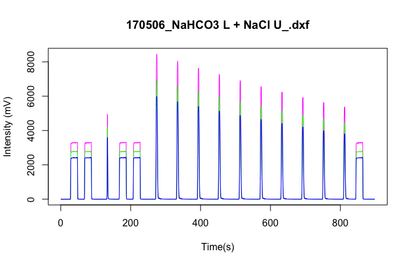

QCIRMS Tutorial
================
Brett McKinney and Lily Clough
2026-03-22

- [Overview](#overview)
- [Installation](#installation)
- [Load packages](#load-packages)
- [Example 1: Inspect one packaged DXF
  file](#example-1-inspect-one-packaged-dxf-file)
  - [Read the file summary](#read-the-file-summary)
  - [Vendor peak table](#vendor-peak-table)
  - [Raw chromatogram data](#raw-chromatogram-data)
  - [Reference values](#reference-values)
  - [Plot one chromatogram](#plot-one-chromatogram)
- [Example 2: Batch processing for a directory of DXF
  files](#example-2-batch-processing-for-a-directory-of-dxf-files)
- [Example 3: Directory-level QA/QC with expected reference
  times](#example-3-directory-level-qaqc-with-expected-reference-times)
  - [Run `QAQC_IRMS()`](#run-qaqc_irms)
  - [Extract QA/QC outputs](#extract-qaqc-outputs)
  - [Internal standards (optional)](#internal-standards-optional)
- [Suggested next steps](#suggested-next-steps)
- [Session information](#session-information)

# Overview

This tutorial walks through a practical QCIRMS workflow for
continuous-flow isotope ratio mass spectrometry (IRMS) data stored in
Thermo `.dxf` files. It is adapted from the package pipeline script and
reorganized as a reproducible R Markdown analysis.

The workflow has four parts:

1.  install and load dependencies;
2.  inspect a single `.dxf` file;
3.  process a directory of files and generate chromatogram plots;
4.  run the `QAQC_IRMS()` directory-level QA/QC workflow.

# Installation

QCIRMS currently depends on `isoreader`, which is installed from GitHub.

``` r
install.packages(c("dplyr", "pracma"))
install.packages("pak")

pak::pak("isoverse/isoreader")
pak::pak("insilico/QCIRMS")
```

# Load packages

``` r
library(QCIRMS)
library(isoreader)
library(dplyr)
library(pracma)
```

# Example 1: Inspect one packaged DXF file

QCIRMS ships with a small example DXF file in `inst/extdata`.

``` r
dxf_file <- "170506_NaHCO3 L + NaCl U_.dxf"
file_path <- system.file("extdata", "dxf_files", "abiotic", dxf_file, package = "QCIRMS")

file_path
```

    ## [1] "/Library/Frameworks/R.framework/Versions/4.1/Resources/library/QCIRMS/extdata/dxf_files/abiotic/170506_NaHCO3 L + NaCl U_.dxf"

## Read the file summary

``` r
file_summ <- read_summary(file_path)
```

    ##                   Length Class           Mode
    ## version            1     package_version list
    ## read_options       4     -none-          list
    ## file_info         16     tbl_df          list
    ## method_info        3     -none-          list
    ## raw_data           5     tbl_df          list
    ## vendor_data_table 39     tbl_df          list

``` r
str(file_summ, max.level = 1)
```

    ##  'summaryDefault' chr [1:6, 1:3] " 1" " 4" "16" " 3" " 5" "39" ...
    ##  - attr(*, "dimnames")=List of 2

## Vendor peak table

``` r
vend_df <- vendor_info(file_path)
dplyr::glimpse(vend_df)
```

    ## Rows: 17
    ## Columns: 40
    ## $ file_id           <chr> "170506_NaHCO3 L + NaCl U_.dxf", "170506_NaHCO3 L + …
    ## $ Nr.               <int> 1, 2, 3, 4, 5, 6, 7, 8, 9, 10, 11, 12, 13, 14, 15, 1…
    ## $ Start             <dbl[s]> 27.170, 66.880, 131.043, 166.364, 206.492, 270.44…
    ## $ Rt                <dbl[s]> 47.443, 87.153, 133.551, 186.637, 226.556, 274.62…
    ## $ End               <dbl[s]> 50.787, 90.497, 140.030, 189.981, 229.900, 280.26…
    ## $ `Ampl 44`         <dbl[mV]> 2425.98279, 2425.01937, 3592.12560, 2425.83698, …
    ## $ `Ampl 45`         <dbl[mV]> 2788.82883, 2787.82824, 4210.89010, 2788.40579, …
    ## $ `Ampl 46`         <dbl[mV]> 3307.89559, 3306.34882, 4936.99954, 3307.00156, …
    ## $ `BGD 44`          <dbl[mV]> 1.207758, 1.599683, 1.429455, 1.570985, 1.663159…
    ## $ `BGD 45`          <dbl[mV]> 0.5735142, 0.9146100, 0.7790426, 0.9509011, 1.10…
    ## $ `BGD 46`          <dbl[mV]> 2.175937, 2.696454, 2.514959, 2.514959, 2.817206…
    ## $ `rIntensity 44`   <dbl[mVs]> 47197.497, 47201.849, 5554.191, 47221.290, 4696…
    ## $ `rIntensity 45`   <dbl[mVs]> 54257.8261, 54260.9364, 6496.6322, 54283.1313, …
    ## $ `rIntensity 46`   <dbl[mVs]> 64359.3893, 64363.6999, 7857.1638, 64393.0715, …
    ## $ `rIntensity All`  <dbl[mVs]> 165814.7127, 165826.4857, 19907.9866, 165897.49…
    ## $ `Intensity 44`    <dbl[Vs]> 47.197497, 47.201849, 5.554191, 47.221290, 46.96…
    ## $ `Intensity 45`    <dbl[Vs]> 0.542578261, 0.542609364, 0.064966322, 0.5428313…
    ## $ `Intensity 46`    <dbl[Vs]> 0.1930781679, 0.1930910997, 0.0235714915, 0.1931…
    ## $ `Intensity All`   <dbl[Vs]> 47.9331537, 47.9375499, 5.6427284, 47.9573001, 4…
    ## $ `List First Peak` <int> 1, NA, NA, NA, NA, NA, NA, NA, NA, NA, NA, NA, NA, N…
    ## $ `rR 45CO2/44CO2`  <dbl> 1.149591, 1.149551, 1.169681, 1.149548, 1.149502, 1.…
    ## $ `rR 46CO2/44CO2`  <dbl> 1.363619, 1.363584, 1.414637, 1.363645, 1.363629, 1.…
    ## $ `Is Ref.?`        <int> 0, 1, 0, 0, 0, 0, 0, 0, 0, 0, 0, 0, 0, 0, 0, 0, 0
    ## $ `R 45CO2/44CO2`   <dbl> 0.01155593, 0.01155553, 0.01175788, 0.01155550, 0.01…
    ## $ `Ref. Name`       <chr> "CO2_zero", "CO2_zero", "CO2_zero", "CO2_zero", "CO2…
    ## $ `rd 45CO2/44CO2`  <dbl[permil]> 0.034883986, 0.000000000, 17.511291745, -0.002809301…
    ## $ `d 45CO2/44CO2`   <dbl[permil]> -35.78837, -35.82200, -18.93800, -35.82471, …
    ## $ `R 46CO2/44CO2`   <dbl> 0.003858720, 0.003858623, 0.004003090, 0.003…
    ## $ `rd 46CO2/44CO2`  <dbl[permil]> 0.025231593, 0.000000000, 37.440139655, 0.044468138,…
    ## $ `d 46CO2/44CO2`   <dbl[permil]> -40.013820, -40.038042, -4.096932, -39.99535…
    ## $ `R 13C/12C`       <dbl> 0.01076804, 0.01076765, 0.01095492, 0.010767…
    ## $ `d 13C/12C`       <dbl[permil]> -36.86486, -36.90000, -20.15020, -36.90452, -36.9453…
    ## $ `AT% 13C/12C`     <dbl[%]> 1.065333, 1.065294, 1.083621, 1.065289, 1.06…
    ## $ `R 18O/16O`       <dbl> 0.001925040, 0.001924992, 0.001997066, 0.00192507…
    ## $ `d 18O/16O`       <dbl[permil]> -39.975829, -40.000000, -4.056312, -39.957255, -39.9…
    ## $ `AT% 18O/16O`     <dbl[%]> 0.1921342, 0.1921294, 0.1993086, 0.1921379, …
    ## $ `R 17O/16O`       <dbl> 0.0003939452, 0.0003939401, 0.0004014832, 0.00039…
    ## $ `d 17O/16O`       <dbl> 0.012991838, 0.000000000, 19.147848528, 0.022975059,…
    ## $ `Rps 45CO2/44CO2` <dbl> NA, 0.01198485, NA, NA, NA, NA, NA, NA, NA, NA, NA, …
    ## $ `Rps 46CO2/44CO2` <dbl> NA, 0.004019558, NA, NA, NA, NA, NA, NA, NA, NA, NA,…

``` r
head(vend_df[, 1:min(10, ncol(vend_df))])
```

    ##                         file_id Nr.   Start      Rt     End  Ampl 44  Ampl 45
    ## 1 170506_NaHCO3 L + NaCl U_.dxf   1  27.170  47.443  50.787 2425.983 2788.829
    ## 2 170506_NaHCO3 L + NaCl U_.dxf   2  66.880  87.153  90.497 2425.019 2787.828
    ## 3 170506_NaHCO3 L + NaCl U_.dxf   3 131.043 133.551 140.030 3592.126 4210.890
    ## 4 170506_NaHCO3 L + NaCl U_.dxf   4 166.364 186.637 189.981 2425.837 2788.406
    ## 5 170506_NaHCO3 L + NaCl U_.dxf   5 206.492 226.556 229.900 2432.543 2796.017
    ## 6 170506_NaHCO3 L + NaCl U_.dxf   6 270.446 274.626 280.269 5976.789 6989.818
    ##    Ampl 46   BGD 44    BGD 45
    ## 1 3307.896 1.207758 0.5735142
    ## 2 3306.349 1.599683 0.9146100
    ## 3 4937.000 1.429455 0.7790426
    ## 4 3307.002 1.570985 0.9509011
    ## 5 3316.630 1.663159 1.1018519
    ## 6 8451.918 1.446664 0.8344063

## Raw chromatogram data

``` r
raw_df <- raw_data(file_path)
dplyr::glimpse(raw_df)
```

    ## Rows: 4,298
    ## Columns: 6
    ## $ file_id <chr> "170506_NaHCO3 L + NaCl U_.dxf", "170506_NaHCO3 L + NaCl U_.dx…
    ## $ tp      <int> 1, 2, 3, 4, 5, 6, 7, 8, 9, 10, 11, 12, 13, 14, 15, 16, 17, 18,…
    ## $ time.s  <dbl> 0.209, 0.418, 0.627, 0.836, 1.045, 1.254, 1.463, 1.672, 1.881,…
    ## $ v44.mV  <dbl> 1.128612, 1.130524, 1.117143, 1.117143, 1.124789, 1.113320, 1.…
    ## $ v45.mV  <dbl> 0.4017511, 0.3998433, 0.4208301, 0.3941199, 0.4151062, 0.41319…
    ## $ v46.mV  <dbl> 2.038189, 1.996066, 1.942465, 1.942465, 1.927152, 1.967350, 2.…

``` r
head(raw_df)
```

    ##                         file_id tp time.s   v44.mV    v45.mV   v46.mV
    ## 1 170506_NaHCO3 L + NaCl U_.dxf  1  0.209 1.128612 0.4017511 2.038189
    ## 2 170506_NaHCO3 L + NaCl U_.dxf  2  0.418 1.130524 0.3998433 1.996066
    ## 3 170506_NaHCO3 L + NaCl U_.dxf  3  0.627 1.117143 0.4208301 1.942465
    ## 4 170506_NaHCO3 L + NaCl U_.dxf  4  0.836 1.117143 0.3941199 1.942465
    ## 5 170506_NaHCO3 L + NaCl U_.dxf  5  1.045 1.124789 0.4151062 1.927152
    ## 6 170506_NaHCO3 L + NaCl U_.dxf  6  1.254 1.113320 0.4131983 1.967350

## Reference values

``` r
stand_ratio_df <- reference_values_ratio(file_path)
stand_no_ratio_df <- reference_values_no_ratio(file_path)

head(stand_ratio_df)
```

    ##                         file_id standard gas delta_name delta_value reference
    ## 1 170506_NaHCO3 L + NaCl U_.dxf CO2_zero CO2  d 13C/12C       -36.9      VPDB
    ## 2 170506_NaHCO3 L + NaCl U_.dxf CO2_zero CO2  d 13C/12C       -36.9      VPDB
    ## 3 170506_NaHCO3 L + NaCl U_.dxf CO2_zero CO2  d 13C/12C       -36.9      VPDB
    ## 4 170506_NaHCO3 L + NaCl U_.dxf CO2_zero CO2  d 18O/16O       -40.0     VSMOW
    ## 5 170506_NaHCO3 L + NaCl U_.dxf CO2_zero CO2  d 18O/16O       -40.0     VSMOW
    ## 6 170506_NaHCO3 L + NaCl U_.dxf CO2_zero CO2  d 18O/16O       -40.0     VSMOW
    ##   element ratio_name ratio_value
    ## 1       C  R 13C/12C  0.01118020
    ## 2       O  R 18O/16O  0.00206720
    ## 3       O  R 17O/16O  0.00038600
    ## 4       H    R 2H/1H  0.00015575
    ## 5       O  R 17O/16O  0.00037990
    ## 6       O  R 18O/16O  0.00200520

``` r
head(stand_no_ratio_df)
```

    ##                         file_id standard gas delta_name delta_value reference
    ## 1 170506_NaHCO3 L + NaCl U_.dxf CO2_zero CO2  d 13C/12C       -36.9      VPDB
    ## 2 170506_NaHCO3 L + NaCl U_.dxf CO2_zero CO2  d 18O/16O       -40.0     VSMOW

## Plot one chromatogram

``` r
generic_raw_plot(
  raw.df = raw_df,
  title = dxf_file
)
```



# Example 2: Batch processing for a directory of DXF files

For a local experiment directory, set `data_dir` to a folder containing
`.dxf` files. If you knit this document without parameters, the chunk
below is skipped.

``` r
DATA_PATH <- params$data_dir
RESULTS_PATH <- params$results_dir

if (is.null(RESULTS_PATH) && !is.null(DATA_PATH)) {
  RESULTS_PATH <- file.path(DATA_PATH, "QCresults")
  dir.create(RESULTS_PATH, recursive = TRUE, showWarnings = FALSE)
}
```

``` r
file_names <- all_dxf_files(path = DATA_PATH)
length(file_names)
head(file_names)

raw_list <- raw_data_all(file_names, path = DATA_PATH)
length(raw_list)
```

``` r
generic_plot_all_raw(
  raw.list = raw_list,
  path = RESULTS_PATH,
  write_pdf = TRUE,
  pdf_name = "all_dxf.pdf"
)
```

# Example 3: Directory-level QA/QC with expected reference times

To run the full pipeline you need:

- a directory of `.dxf` files;
- a table of expected reference-peak times, for example
  `referencePeaks_expectedTimes.txt`;
- an output directory for results.

``` r
REF_TIME_FILE <- params$ref_time_file

if (!is.null(REF_TIME_FILE)) {
  expRef_df <- read.table(REF_TIME_FILE, header = TRUE)
  expRef_df
}
```

## Run `QAQC_IRMS()`

``` r
start_time <- Sys.time()

curr_filtered <- QAQC_IRMS(
  unfilteredPath = DATA_PATH,
  expRef.df = expRef_df,
  checkIntStand = TRUE,
  internalStandID = c("L1", "H1", "LW"),
  dataName = basename(DATA_PATH),
  maxPkNum = 18,
  expectedNonSampPks = 7,
  sdCrefIso.thresh = 0.1,
  sdOrefIso.thresh = 0.1,
  checkRelDiffIntensity = TRUE,
  refSamp_relDiffInt.thresh = 0.75,
  amplName = "Ampl44",
  ref_relDiffInt.thresh = 0.1,
  sdCsampIso.thresh = 0.3,
  sdOsampIso.thresh = 0.2,
  outPath = RESULTS_PATH,
  verbose = TRUE
)

elapsed <- Sys.time() - start_time
elapsed
```

## Extract QA/QC outputs

``` r
refs_dat <- curr_filtered[[1]]
samps_dat <- curr_filtered[[2]]

dim(refs_dat)
dim(samps_dat)

head(refs_dat)
head(samps_dat)
```

## Internal standards (optional)

``` r
int_stand_list <- curr_filtered[[3]]

length(int_stand_list)
str(int_stand_list, max.level = 1)
```

# Suggested next steps

- Add this tutorial as a package vignette under `vignettes/`.
- Replace any hard-coded paths with `params` or `here::here()`.
- Keep only small demonstration files in `inst/extdata/`.
- Store larger local data outside the installed package and document the
  expected directory structure.

# Session information

``` r
sessionInfo()
```

    ## R version 4.1.2 (2021-11-01)
    ## Platform: x86_64-apple-darwin17.0 (64-bit)
    ## Running under: macOS Big Sur 10.16
    ## 
    ## Matrix products: default
    ## BLAS:   /Library/Frameworks/R.framework/Versions/4.1/Resources/lib/libRblas.0.dylib
    ## LAPACK: /Library/Frameworks/R.framework/Versions/4.1/Resources/lib/libRlapack.dylib
    ## 
    ## locale:
    ## [1] en_US.UTF-8/en_US.UTF-8/en_US.UTF-8/C/en_US.UTF-8/en_US.UTF-8
    ## 
    ## attached base packages:
    ## [1] stats     graphics  grDevices utils     datasets  methods   base     
    ## 
    ## other attached packages:
    ## [1] pracma_2.4.4      dplyr_1.1.4       isoreader_1.4.0   QCIRMS_0.0.0.9000
    ## 
    ## loaded via a namespace (and not attached):
    ##  [1] pillar_1.10.2     compiler_4.1.2    prettyunits_1.2.0 progress_1.2.3   
    ##  [5] R.methodsS3_1.8.2 R.utils_2.13.0    tools_4.1.2       digest_0.6.37    
    ##  [9] lubridate_1.9.4   evaluate_1.0.3    lifecycle_1.0.4   tibble_3.2.1     
    ## [13] timechange_0.3.0  pkgconfig_2.0.3   rlang_1.1.6       cli_3.6.5        
    ## [17] rstudioapi_0.17.1 yaml_2.3.10       parallel_4.1.2    xfun_0.52        
    ## [21] fastmap_1.2.0     withr_3.0.2       stringr_1.5.1     knitr_1.50       
    ## [25] generics_0.1.3    vctrs_0.6.5       globals_0.17.0    hms_1.1.3        
    ## [29] tidyselect_1.2.1  glue_1.8.0        listenv_0.9.1     R6_2.6.1         
    ## [33] parallelly_1.43.0 rmarkdown_2.29    purrr_1.0.4       readr_2.1.5      
    ## [37] tzdb_0.5.0        tidyr_1.3.1       magrittr_2.0.3    codetools_0.2-20 
    ## [41] htmltools_0.5.8.1 future_1.40.0     stringi_1.8.7     crayon_1.5.3     
    ## [45] R.oo_1.27.0
